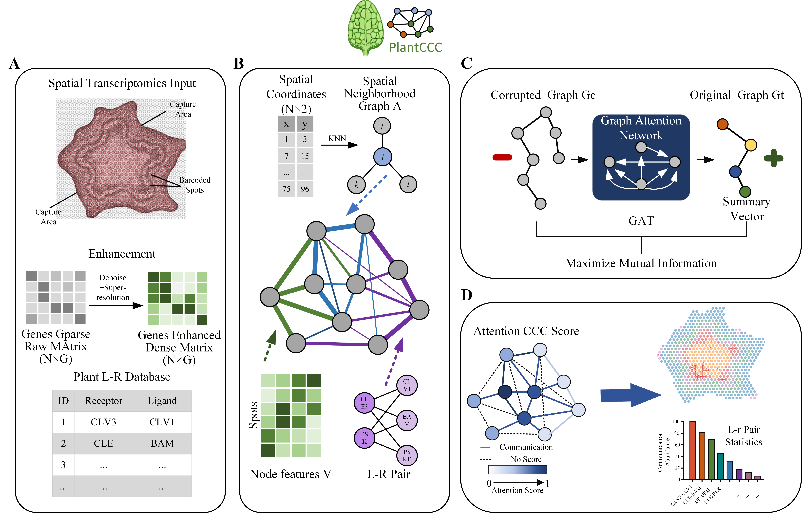

# PlantCCC: A Spatial-aware Graph Deep Learning Framework for Plant Cell-Cell Communication

[](https://www.python.org/)
[](https://pytorch.org/)
[](LICENSE)

## 📝 Introduction

**PlantCCC** is a novel deep learning framework designed to infer **spatially-resolved cell-cell communication (CCC)** in plants.

Cell-cell communication is a core mechanism in plant development and environmental response. However, existing databases often rely on unverified candidates, and traditional inference methods based solely on co-expression ignore the crucial **spatial proximity** of cells.

To address these challenges, PlantCCC integrates **Spatial Transcriptomics (ST)** data with **Graph Deep Learning**. By constructing a heterogeneous graph that combines spatial adjacency with ligand-receptor co-expression, PlantCCC utilizes a **Multi-head Graph Attention Network (GAT)** and **Deep Graph Information Maximization (DGI)** to learn spatial synergistic features.

### Key Features
*   **Spatial-Awareness**: Explicitly encodes spatial proximity into the communication inference process.
*   **Denoising & Enhancement**: Customized expression enhancement tailored for plant ST data.
*   **High Confidence**: Uses attention scores as a metric for interaction reliability to filter false positives.
*   **Dynamic Analysis**: Capable of revealing dynamic reprogramming of CCC across developmental stages (e.g., Poplar stem secondary growth).

---

## 🏗️ The Overall Framework

The PlantCCC framework is composed of four integral modules, as illustrated below:

*   **(A) Data Preprocessing & Enhancement**: Preprocessing of spatial transcriptomics inputs and targeted gene expression enhancement to mitigate data sparsity.
*   **(B) Heterogeneous Graph Construction**: Construction of candidate communication heterogeneous graphs integrating spatial coordinates and ligand-receptor pairs.
*   **(C) Spatially-aware GAT & Contrastive Learning**: Learning spatial synergistic features using Spatially-aware Graph Attention Networks (GAT) coupled with contrastive learning strategies.
*   **(D) Scoring & Aggregation**: Calculation of communication scores based on attention weights and aggregation of high-confidence results.


*(Fig 1. Overview of the PlantCCC workflow.)*

---

## 🛠️ System Requirements

### Hardware
*   **GPU**: NVIDIA GPU with CUDA support (Recommended for GAT training).
*   **RAM**: 16GB or higher.

### Software
*   **OS**: Linux (Ubuntu 18.04+) or Windows 10/11.
*   **Python**: 3.8 or higher.

### Dependencies
Please install the required Python packages using the following command:

```bash
pip install -r requirements.txt
